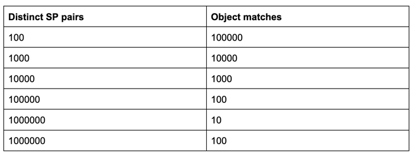

# rocksdb-bench

## Introduction

```
Most of the Open Source triple stores such as Apache Jena, RDF4J, 
Oxigraph, etc. use KV-store in the bottom most layer to store triples.
The storage layer plays a major role in performance score of any
storage engine. The repository contains a benchmark code that can be used for
testing Read write performance of any KV-store for storage and retrieval of RDF-triples.
The benchmark improves the observability of the triple store performance.
We have provided:
- Common interfaces that can be extended by any KV-store.
- A workload configuration that can be configured to cover a wide spectrum of triple workloads.
- A benchmark code that uses the common interfaces and the workload 
  configuration to test read and write performance of the KV-store.
- Benchmark results for Apache Jena B+ Tree and RocksDB as a use case.
```

## Experiment Setup

```
Machine 1 - Intel core i7 - 9750H CPU @2.60 GHz x 12 (SSD)
Machine 2 - AMD Ryzen 7 5700G x86_64 (NVME)
```

## Workload configuration
```
Consider (S,P,O) as input triple. Each of size
8 bytes. Here key is SPO of size 24 bytes. For each SP pair we have N number
of Object **matches**. 
```


## Tuning Parameters
- ReadAhead size
- Direct I/O 
- Data block Size 
- Disable Compression and Checksum
- Bloom Filter 
- Prefix Bloom filter 
- Memtable Bloom filter
- Asynchronous I/O  
- Compaction Styles
- Compression types
- maxOpenFiles 
- memtablePrefixBloomSizeRatio 
- Block Cache 
- cacheIndexAndFilterBlocks
- Single SST file
- No of background threads

## Result
```
For workload type-6 by removing compression and checksum we were able
to increase read score of rocksDB (43.4521s)
which was 62.4660s (for default configuration) although increasing space
due to disabling compression. Jena B+ tree uses more memory 
than RocksDB. Maybe as RockDB uses compression techniques it takes much less 
space than Jena. 

The read performance of RocksDb increased when all the sst files were 
compacted into single sst file(34.7649s and 11s for java and c++ implementation of RocksDb respectively)
using Universal compaction by LDB tool. 
```

## Benchmark scores
https://github.com/TW-Genesis/rocksdb-bench/blob/main/RocksDb-vs-Jena.csv
